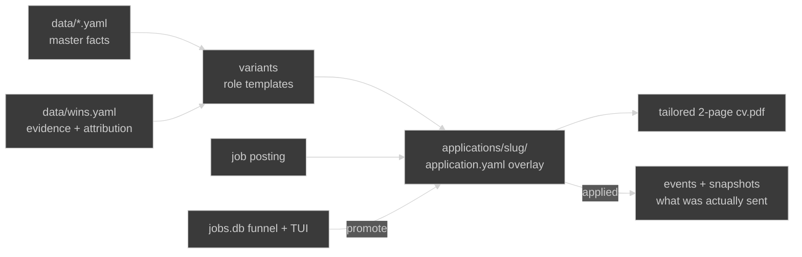
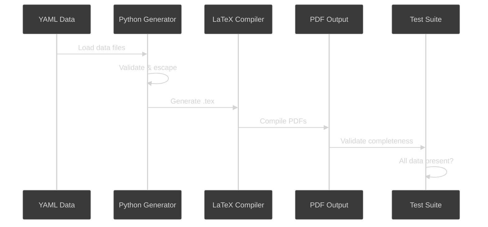

# CV Pipeline Template

> **Click "Use this template" to create your own CV pipeline!**

Automated CV generation pipeline that creates multiple psychologically-optimized CV variants from YAML data.

**🆕 Now a positioning system with non-intrusive AI: per-posting tailoring overlays, an honest evidence store, a job funnel with a kanban TUI, and skills that make Claude Code or Codex follow a precise workflow: select and reword facts from your YAML files, never invent them.**

## Video Tutorial

Watch the complete walkthrough of this CV pipeline template:

[](https://youtu.be/S2gpOr-mbf4)

**CV Pipeline as Code: LaTeX, YAML, and GitHub Actions** - Learn how to use this template to automate your CV generation workflow.

## Why This Approach?

**The AI Trap**: Most people use AI wrong for CVs

```mermaid
%%{init: {"theme": "dark", "themeVariables": {"darkMode": true, "background": "#2b2b2b", "mainBkg": "#3a3a3a", "secondBkg": "#4a4a4a"}}}%%
graph LR
    A[AI] -->|❌ Wrong| B[Complete CV]
    A -->|✓ Right| C[YAML Data]
    C --> D[Your Pipeline]
    D --> E[Professional CV]

    style B fill:#4a3a4a,stroke:#e599f7,stroke-width:2px
    style E fill:#3a4a3a,stroke:#94d82d,stroke-width:2px
```



**The Right Approach:**
- YOU write the facts as structured YAML (AI may help you structure them, never invent them)
- YOU control the pipeline and output
- Consistent quality across all variants
- Version controlled career narrative
- Update once → all CVs updated automatically

**Non-intrusive AI.** The agent never gets a blank page. At tailoring time it receives a bounded menu (the posting, every fact in your YAML, and the attribution flags that say what must not be inflated) and its only job is to select, reorder, and reword from that menu. It cannot add a metric, a title, or a date that is not already in `data/`, and two project skills hold it to that workflow step by step. Hallucination is closed off by the shape of the task, not by asking nicely. Because the agent reads and writes files you version, you can also ignore it entirely and edit the overlay by hand.

## The Positioning System

This is a positioning system, not a CV generator. The core job is matching, not writing: for each posting, select and emphasize what aligns and cut the rest. Relevance over completeness.



Three layers, no duplication:

- `data/*.yaml` holds the facts. The only place they live.
- Variants in `scripts/generate.py` are role types (software developer, DevOps engineer, cloud engineer): a palette, a default profile, default selections. All share one fixed two-page layout.
- `applications/<slug>/application.yaml` is one file per real posting: the tracking record (`meta:`) and a thin overlay (`base:` + `overrides:`) that selects, reorders, and rewords facts for that posting. It never adds facts.

### Per-application workflow

```bash
# scaffold a folder (or promote a job from the funnel with --from-job <id>)
python3 -m scripts.application new acme-devops --variant devops-engineer \
    --company "Acme Cloud" --role "Senior DevOps Engineer" --url https://...

# paste the posting into applications/acme-devops/job-posting.md, then print the brief
python3 -m scripts.application tailor acme-devops

# your AI agent writes overrides: from the brief (see the skills below); then build
python3 -m scripts.application build acme-devops      # -> applications/acme-devops/cv.pdf

# track it
python3 -m scripts.application status                 # the pipeline board
python3 -m scripts.application set-status acme-devops applied
python3 -m scripts.application events acme-devops     # outcome timeline + snapshots
```

`applications/example-acme-devops-engineer/` is a worked example against the sample data. Delete it once you have real ones.

The overlay schema (tagline, profile paragraphs, highlights, strength indices, expertise tags, sidebar "Why <Company>" blocks, palette and font borrowing) is documented in `.claude/skills/cv-applications/SKILL.md`.

### The evidence store and attribution flags

`data/wins.yaml` is where achievements live with their evidence: `cv_highlights` are the short CV-ready lines the generators and the tailoring brief read; `wins` carries the source, date, and who did what behind each line. `meta.attribution_flags` records anything an overlay must never flatten: a metric a colleague measured on a system you built, work that was co-led. The agent reads these flags in every tailoring brief. This is the honesty layer that makes AI tailoring safe to use.

### Skills for Claude Code and Codex

Two project skills auto-load in this repo (`.claude/skills/` for Claude Code, mirrored at `.agents/skills/` for Codex; `CLAUDE.md` and `AGENTS.md` carry the repo guidance):

- `cv-applications`: the system's purpose, the agent's role per phase (discovery, selection, positioning, data evolution, outcome adaptation), the commands, the overlay schema, the TUI bridge, and the honesty guardrails.
- `cv-writing`: the craft. Impact-led bullets, no posting-checklist echo, three-paragraph profiles, cover letters, and the sizing rules that keep a CV on two pages.

Ask your agent to "tailor a CV for this posting" and it will run the brief, write honest overrides, build, and tell you what it could not support from your facts.

### Outcome history

Every board status change appends to an `application_events` timeline, and the applied transition freezes an immutable `application_snapshots` row: the resolved highlights, strengths, experience, expertise, PDF hash, and a verbatim copy of the overlay. Overlays and master data drift, so this is the only reliable record of what was sent. The aggregate analysis on top is intentionally not built yet; the skill explains the discipline for when it is (patterns across many applications, never an explanation for one).

### Job funnel and kanban TUI

```bash
make setup        # one-time venv with the TUI dependency
make jobs-tui     # pull jobs, score them, promote to applications, hand rows to your agent
```

Sources: Remotive, DevRelCareers, RemoteOK, Himalayas, CNCF member boards, WeWorkRemotely. Scoring, title keywords, location rules, and the LLM title filter all read `data/goals.yaml`, so the funnel targets your roles, not the template author's. In the TUI, `c` on a job hands an evaluation prompt to the `claude` or `codex` pane in your tmux window; `c` on an application hands it the tailoring task. `a` promotes a job to the Applications tab; `s` advances its status (which also snapshots the sent composition). Optional push notifications go through an ntfy.sh topic you set in `goals.yaml` or `JOBS_NTFY_TOPIC`.

## Quick Start

### 1. Use This Template

Click the green "Use this template" button above to create your own repository.

### 2. Edit Your Data

Update the YAML files in `data/` with your information:

```bash
# Edit your personal info
vim data/personal.yaml

# Edit your work experience
vim data/experience.yaml

# Edit skills, education, certifications, strengths
vim data/skills.yaml data/education.yaml data/certifications.yaml data/strengths.yaml
```

### 3. Push to GitHub

```bash
git add .
git commit -m "Add my CV data"
git push
```

### 4. Get Your CVs

GitHub Actions will automatically:
- Generate 3 CV variants
- Run tests to verify all data is included
- Create a release with PDF downloads

Download from: `https://github.com/YOUR_USERNAME/YOUR_REPO/releases/latest`

## What You Get

### 📄 Multiple CV Formats

**Three psychologically-optimized PDF variants**, all on one fixed two-page layout (page 1 is the pitch: profile, highlights, strengths; page 2 is the detail: experience, expertise, education, certifications):
- **Software Developer** - Creativity, problem-solving, technical expertise (Purple - innovation)
- **DevOps Engineer** - Collaboration, automation, developer enablement (Orange - energy & approachability)
- **Cloud Engineer** - Trust, scalability, expertise (Blue - professionalism)

**Plus ATS-friendly plain text versions** for online applications that get past Applicant Tracking Systems.

Each variant picks its highlights from `data/wins.yaml` (falling back to achievements tagged for that role) and uses color psychology to create the right first impression. A per-posting overlay then tailors any variant further.

### 📚 Comprehensive Content Guides

**Because formatting alone won't get you the job - great content will.**

This template now includes extensive guides to help you:

- **[Content Writing Guide](docs/CONTENT_GUIDE.md)** - Learn to write achievements that actually matter
  - The STAR method for impactful statements
  - How to quantify your impact (even without big numbers)
  - Common mistakes junior developers make
  - Before/after examples

- **[Achievement Examples](docs/ACHIEVEMENT_EXAMPLES.md)** - Real-world examples you can adapt
  - Examples for every experience level (junior, mid, student, bootcamp grad, career changer)
  - Organized by role (Software Dev, DevOps, Cloud Engineer)
  - 100+ concrete examples with metrics

- **[ATS Optimization Guide](docs/ATS_GUIDE.md)** - Get past the robots to reach humans
  - Understanding Applicant Tracking Systems
  - Do's and don'ts for ATS-friendly formatting
  - Keyword optimization strategies
  - Testing your CV for ATS compatibility

- **[Cover Letter Guide](docs/COVER_LETTER_GUIDE.md)** - Write compelling cover letters
  - The 4-paragraph structure that works
  - Examples by experience level
  - Customizable templates
  - Common mistakes to avoid

- **[Job Description Tailoring Guide](docs/TAILORING_GUIDE.md)** - Customize smartly for each role
  - The 80/20 approach (don't rewrite from scratch!)
  - Decoding what job descriptions really mean
  - Keyword extraction and optimization
  - Real examples of tailoring the same CV for different jobs

**Plus:** Cover letter template YAML structure to maintain consistency across applications.

## Data Structure

### personal.yaml
Basic contact information and taglines for each variant:

```yaml
first_name: "John"
last_name: "Doe"
email: "john.doe@example.com"
linkedin: "https://linkedin.com/in/johndoe"
github: "https://github.com/johndoe"
taglines:
  software-developer: "Software Developer"
  devops-engineer: "DevOps Engineer"
  cloud-engineer: "Cloud Engineer"
```

### experience.yaml
Work experience with tags for filtering:

```yaml
- title: "Senior Platform Engineer"
  company: "Tech Corp Inc"
  location: "Remote"
  start_date: "01/2022"
  end_date: "present"
  tags: ["technical", "platform", "leadership"]  # Used for filtering!
  achievements:
    - "Led development of microservices architecture"
    - "Improved deployment efficiency by 60%"
```

**Tag guide**:
- `development` - Feeds the Software Developer highlights
- `devops` - Feeds the DevOps Engineer highlights
- `cloud` - Feeds the Cloud Engineer highlights
- Mix tags to appear in multiple variants (page 2 lists the first jobs regardless of tag)

### Other files
- `skills.yaml` - Languages, programming languages, tools, cloud platforms
- `education.yaml` - Degrees and institutions
- `certifications.yaml` - Professional certifications with tags
- `strengths.yaml` - Key strengths with descriptions and tags; variants and overlays select them by index
- `wins.yaml` - Evidence store: CV-ready highlight lines, the wins behind them, and attribution flags
- `goals.yaml` - Job-search targets: profiles, title keywords, skills, location rules, deal breakers

## Customization

### Add New Variants

1. Write a `_spec_<variant>()` builder in `scripts/generate.py` (copy an existing one: palette, fonts, profile paragraphs, strength indices, expertise tags) and register it in `SPEC_BUILDERS` and `STYLE_BY_NAME`
2. Add its tagline to `data/personal.yaml`
3. Tag relevant experience in `data/experience.yaml`
4. Update `Makefile` VARIANTS list and the `.github/workflows/cv-build.yml` matrix
5. Add a role to `data/goals.yaml` if the job funnel should score it

For a single posting you usually do not need a new variant: start from the closest one and tailor it with an application overlay.

### Modify Colors/Design

Palettes are the `_STYLE_*` blocks in `scripts/generate.py`; the shared layout is `render_cv()`. Both use the AltaCV LaTeX class in `templates/altacv-class/`.

**Current color schemes** (based on color psychology research):
- **Software Developer**: Purple (#7C3AED) - Innovation, creativity, problem-solving
- **DevOps Engineer**: Orange (#FF6B35) - Energy, collaboration, developer enablement
- **Cloud Engineer**: Steel Blue (#4682B4) - Trust, reliability, professionalism

## Testing Locally

```bash
# Install dependencies
pip install PyYAML

# Build all CVs
make all

# Run tests (data completeness against the PDFs, plus the hermetic substrate tests)
make test

# View PDFs
ls output/generated/*.pdf
```

### Generate ATS-Friendly Versions

For online job applications, generate plain text versions optimized for Applicant Tracking Systems:

```bash
# Generate all ATS versions
python3 scripts/generate_ats.py --variant software-developer --data-dir data/ --output output/ats/software-developer.txt
python3 scripts/generate_ats.py --variant devops-engineer --data-dir data/ --output output/ats/devops-engineer.txt
python3 scripts/generate_ats.py --variant cloud-engineer --data-dir data/ --output output/ats/cloud-engineer.txt

# View generated text files
ls output/ats/*.txt
```

**When to use each format:**
- **PDF versions**: Networking, direct emails, portfolios, after passing ATS
- **TXT versions**: Online application forms, company career portals

## Requirements

- Python 3.11+ with PyYAML (`make setup` adds the TUI dependencies in a venv)
- TeX Live (pdflatex)
- poppler-utils (pdftotext, pdfinfo)
- Optional: the `claude` CLI for the job funnel's title filter (it fails open without it), tmux for the TUI's `c` hand-off

## How It Works



**Key Steps:**
1. Load YAML data from `data/` directory
2. Python validates and escapes special characters
3. Direct Python string building generates LaTeX (no templates)
4. LaTeX compiler creates professional PDFs
5. Test suite verifies 100% data completeness
6. GitHub Actions automates entire workflow

## Troubleshooting

### PDFs not generating locally?

Check dependencies:
```bash
# Python packages
pip list | grep PyYAML

# LaTeX
pdflatex --version

# PDF utilities
pdftotext -v
```

### Tests failing?

Run verbose test output:
```bash
python scripts/test_data_completeness.py
```

Common issues:
- Missing data in YAML files
- Special characters in LaTeX (use `\&` for `&`, `\%` for `%`)
- Tags not matching template filters

### GitHub Actions failing?

Check:
1. YAML syntax is valid
2. No special characters breaking LaTeX compilation
3. All required files present in repository

## Color Psychology Research

The color schemes for each CV variant are based on research in color psychology and professional perception:

**Research Sources:**
- [Resume Color Psychology - Standout CV](https://standout-cv.com/usa/resume-advice/resume-color-psychology) - How colors influence hiring manager perception
- [Color Psychology in Resume Design](https://www.stopthebleedday.org/2024/02/14/color-psychology-in-resume-design-using-color-to-influence-perception/) - Color impact on first impressions
- [Colors on Your Resume - Resume Giants](https://www.resumegiants.com/blog/colors-on-resume/) - Professional color choices and their meanings

**Key Findings:**
- **Purple (#7C3AED)**: Associated with creativity, innovation, and problem-solving - ideal for Software Developers
- **Orange (#FF6B35)**: Conveys energy, warmth, and collaboration - perfect for DevOps Engineers focused on developer experience
- **Blue (#4682B4)**: Represents trust, reliability, and professionalism - suited for Cloud Engineers

## License

MIT - Use this template freely for your own CV!

## Getting Started With Content

**New to CV writing?** Start here:

1. **Read the [Content Writing Guide](docs/CONTENT_GUIDE.md)** - Learn the fundamentals
2. **Browse [Achievement Examples](docs/ACHIEVEMENT_EXAMPLES.md)** - Find inspiration for your level
3. **Review the [ATS Guide](docs/ATS_GUIDE.md)** - Understand how to get past automated screening
4. **Practice tailoring** with the [Tailoring Guide](docs/TAILORING_GUIDE.md)

**Writing cover letters?**
- Check out the [Cover Letter Guide](docs/COVER_LETTER_GUIDE.md)
- Use `data/cover-letter-template.yaml` as a starting structure

## FAQ

**Q: What makes this different from other CV templates?**
A: This isn't just a template - it's a complete system with comprehensive guides on writing compelling content, passing ATS screening, and tailoring applications. The template handles formatting; the guides help you stand out.

**Q: I'm worried about having the same CV as others. How do I differentiate myself?**
A: **Your unique content differentiates you, not the template.** This is why we've added extensive content guides - to help you write achievements that are specific to your experience and impactful. Two people using this template will have completely different CVs because they have different experiences, achievements, and ways of telling their story.

**Q: Should I use the PDF or ATS text version?**
A: Use **PDF** for: networking, direct emails, LinkedIn, portfolios, in-person meetings. Use **TXT** for: online application portals, company career pages, anywhere that asks you to upload or paste your CV.

**Q: Can I add more CV variants?**
A: Yes! Add a spec builder in `scripts/generate.py` and update the Makefile. For one posting, tailor an existing variant with an application overlay instead.

**Q: If the agent cannot invent anything, why use it at all?**
A: Because the hard part of a CV is not the facts, it is the fit. For every posting someone has to read what the role actually values, pick the five achievements out of thirty that speak to it, order them, and phrase each one in the posting's language without parroting its checklist. That is selection and stylistics, and it is exactly what a language model is good at when the inputs are fixed. The skills make it do that job the same way every time. So the value is real: better matching, better wording, a two-page PDF in minutes per posting. The constraints are what make it safe to hand over.

**Q: How does the AI part stay honest?**
A: The agent never writes facts. It reads a brief (posting + your master facts + attribution flags) and writes an overlay that selects and rewords what is already in `data/`. Attribution flags in `wins.yaml` name the claims it must not inflate, and the applied snapshot records exactly what went out.

**Q: Do I need to configure secrets or tokens?**
A: No! The template works out-of-the-box with no configuration needed.

**Q: Can I customize the LaTeX?**
A: Yes. The layout is `render_cv()` and the palettes are the `_STYLE_*` blocks in `scripts/generate.py`; the class file is in `templates/altacv-class/`.

**Q: How do I change which experience appears in each variant?**
A: Page-1 highlights come from `wins.yaml` or from achievements tagged for that variant in `experience.yaml`. Page 2 lists the first `experience_count` jobs; an application overlay can change the count and the achievements per job.

**Q: Can I use this for commercial purposes?**
A: Yes! This template is MIT licensed - use it however you'd like.

**Q: I'm a bootcamp grad / career changer / student. Will this work for me?**
A: Absolutely! Check out the [Achievement Examples](docs/ACHIEVEMENT_EXAMPLES.md) which has sections specifically for bootcamp grads, career changers, students, and interns with relevant examples you can adapt.
